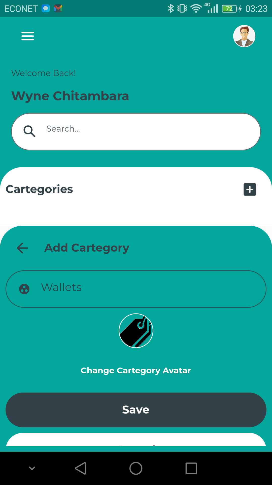
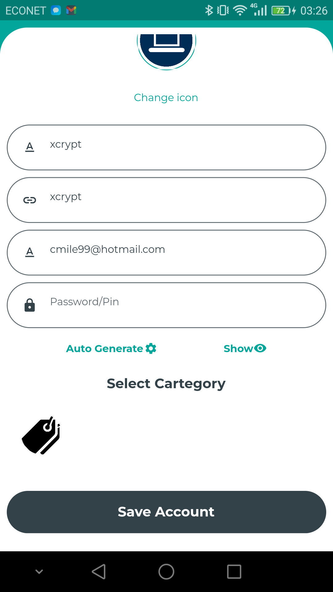
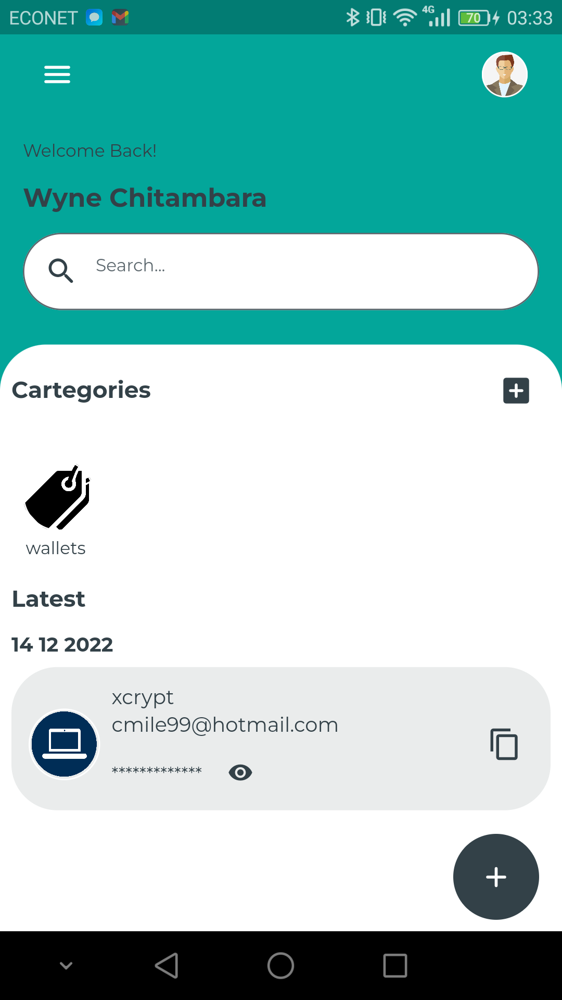

# xpassmanager

Xpass mangager is a simple password manager that helps you keep all your passwords in one place instead of having ot remember a bunch of passwords you just have to remember the master password. This app implemented using flutter and dart.

## Work in progress
- bugs are still work in progresss

## Screenshots

### login and registration

### adding cartegory and password credentials

### saved credentials

you can view the password or copy the password to clipboard

